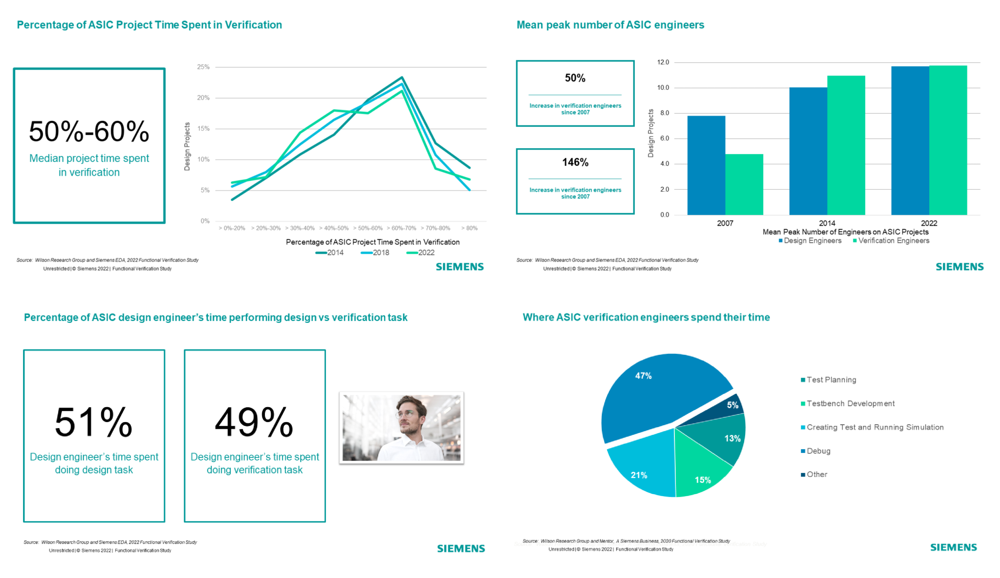

# Тема 00: Вводная

- [Тема 00: Вводная](#тема-00-вводная)
  - [Краткое содержание](#краткое-содержание)
  - [Актуальность верификации цифровых устройств](#актуальность-верификации-цифровых-устройств)
  - [Верификация процессорных ядер](#верификация-процессорных-ядер)
  - [Архитектура набора команд RISC-V](#архитектура-набора-команд-risc-v)
  - [Особенности RISC-V](#особенности-risc-v)
    - [Открытость](#открытость)
    - [Модульность](#модульность)
  - [Вектор развития RISC-V](#вектор-развития-risc-v)
  - [To be continued...](#to-be-continued)

## Краткое содержание

Данное занятие является вводным и рассказывает о причинах актуальности верификации цифровых устройств и особой актуальности верификации процессорных ядер.

Также в занятии дается краткое описание архитектуры набора команд RISC-V и ее особенностей, описывается предполагаемый вектор развития RISC-V.

## Актуальность верификации цифровых устройств

В настоящее время проблема верификации[^1] цифровых устройств является актуальной, как никогда ранее. Размеры кристаллов увеличиваются с каждым годом согласно [закону Мура](https://en.wikipedia.org/wiki/Moore%27s_law). Увеличивается количество функциональных блоков, возрастают архитектурная и микроархитектурная сложности.

Каждые 2 года компания Siemens публикует исследование, связанное с основными трендами верификации заказных цифровых схем. Последнее опубликованное (на момент написание данного текста) [исследование](https://blogs.sw.siemens.com/verificationhorizons/2022/12/12/part-8-the-2022-wilson-research-group-functional-verification-study/) показывает, что:

- процесс верификации современных цифровых устройств в среднем занимает 50-60% времени всего маршрута проектирования;
- количество инженеров-верификаторов примерно равно количеству инженеров-разработчиков.

Инженеры со всего мира работают над решением задачи ускорения процессов тестирования. Разрабатываются [методологии верификации](https://www.accellera.org/downloads/standards/uvm), создаются [различные системы автоматизации](https://github.com/olofk/fusesoc), предпринимаются [попытки выхода на более высокий уровень абстракции](https://www.cocotb.org).

## Верификация процессорных ядер

Системы на Кристалле состоят из множества аналоговых и цифровых устройств, работающих независимо или совместно. **Основным цифровым устройством систем в большинстве случаев является процессор**, выполняющий программную обработку цифровых данных. Сфера верификации процессорных ядер является одной из самых актуальных составляющих индустрии проектирования и тестирования сложно-функциональных блоков.

Большое количество компаний при проектировании выбирают путь использования покупных блоков, которые уже были протестированы и предоставляют определенный уровень надежности. Это касается и процессорных ядер. Например, по состоянию на 2022 год в 90% современных мобильных устройств в настоящее время установлены ядра компании ARM. Однако, **не так давно на рынке процессоров появилась многообещающая архитектура, способная к заданию новых тенденций.**

## Архитектура набора команд RISC-V

В настоящее время все большую популярность набирает **архитектура набора команд (АНК) [RISC-V](https://riscv.org)**. В 2015 году был создан международный фонд архитектуры. Уже с 2018 года он работает в партнёрстве с [The Linux Foundation](https://www.linuxfoundation.org/).

У архитектуры есть несколько особенностей, которые делают ее крайне многообещающей как для использования во всем мире, так и в России в частности. Поговорим ниже об этих особенностях, а также о предполагаемом векторе развития АНК.

## Особенности RISC-V

### Открытость

**Основная отличительная черта архитектуры RISC-V – ее открытость.** Так как АНК может быть использована бесплатно, то уже сейчас вокруг RISC-V сформировалось сообщество из десятков тысяч разработчиков, готовых к сотрудничеству и обмену опытом.

**В 2022 году в России был создан [Альянс RISC-V](https://riscv-alliance.ru/)** - объединение независимых разработчиков вычислительной техники и программного обеспечения на основе данной архитектуры.

### Модульность

**Еще одной особенностью RISC-V является модульность**. Базовый набор содержит 49 инструкций, при этом в спецификациях присутствует **несколько десятков расширений** для аппаратной поддержки дополнительного функционала.

В расширения входит поддержка аппартного умножения/деления (M), вычислений с плавающей точкой (F,D), векторных операций (V), сжатых инструкций (C) и многое другое. Даже [криптографию](https://github.com/riscv/riscv-crypto/releases) "завезли". Также инженерам предоставлена возможность создания [нестандартных команд и их интеграции в архитектуру](https://www.youtube.com/watch?v=PkKfcW72NcI).

## Вектор развития RISC-V

Стоит заметить, что, так как АНК является относительно "молодой", то **наблюдается малое количество высокопроизводительных решений, а также общее сравнительно небольшое количество ядер на рынке.** 

Хотя тенденция развития у архитектуры многообещающая. Например, в [опубликованное в 2022 году исследование](https://riscv.org/blog/2022/02/semico-researchs-new-report-predicts-there-will-be-25-billion-risc-v-based-ai-socs-by-2027) предсказывает к 2027 году наличие 27 миллиардов RISC-V СнК для искусственного интеллекта по всему миру.

Не так давно [поступил в продажу первый ноутбук с ядром на архитектуре RISC-V](https://habr.com/en/companies/selectel/articles/691252/). Множество компаний высказываются в поддержку и проводят инвестиционные программы, например:
- [RISC-V дизайн-центр в Барселоне от Intel](https://www.eenewseurope.com/en/400m-risc-v-design-centre-for-barcelona);
- [Qualcomm разработает решение на RISC-V для умных часов от Google](https://riscv.org/news/2023/10/qualcomm-to-bring-risc-v-based-wearable-platform-to-wear-os-by-google/);
- [Крупнейшая российская компания в сфере систем хранения данных Yadro "переключилась" на архитектуру RISC-V](https://3dnews.ru/1088875/yadro-ushlo-ot-ibm-i-prishlo-k-risc-v).

Представленные выше факты способствуют **созданию ядер на архитектуре RISC-V, в том числе с открытым исходным кодом**. Сообщество активно делится опытом и исследует различные подходы к оптимизации для увеличения производительности, уменьшения площади и энергопотребления кристаллов ядер.

## To be continued...

Если компания выбирает RISC-V как архитектуру для процессорного ядра своей СнК, то, **ввиду отсутствия необходимых решений на рынке готовых СФ-блоков, может появиться необходимость в разработке собственного процессора**. Однако любое новое решение необходимо верифицировать. И здесь инженеры могут столкнуться с рядом проблем, свойственных как процессорным ядрам в целом, так и конкретной архитектуре.

О том, что же такое верификация, в частности функциональная, в частности RISC-V ядер, будет рассказано в [следующем занятии](./01_basics.md).

[^1]: В общем случае, верификация цифрового устройства – процесс обоснованного доказательства его корректной работы в рамках представленной на него спецификации[^2].

[^2]: Спецификация – набор задокументированных требований. Она определяет характеристики устройства.
 