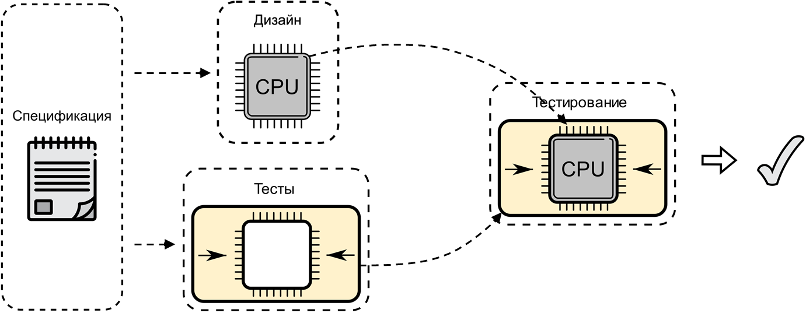
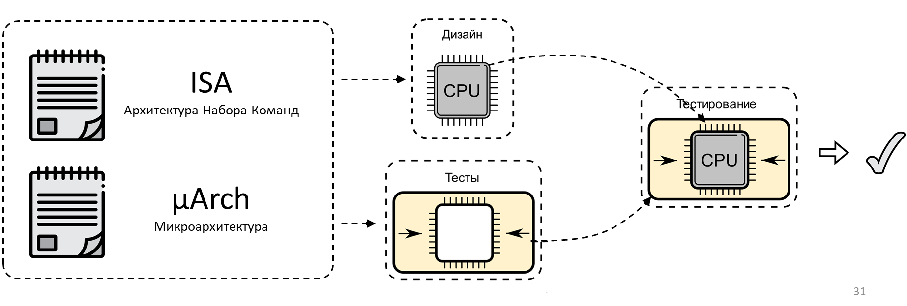

# Тема 01: Функциональная верификация процессорных ядер

- [Тема 01: Функциональная верификация процессорных ядер](#тема-01-функциональная-верификация-процессорных-ядер)
  - [Рекомендуемый материал](#рекомендуемый-материал)
  - [Краткое содержание](#краткое-содержание)
  - [Верификация цифровых устройств](#верификация-цифровых-устройств)
  - [Функциональная верификация цифровых устройств](#функциональная-верификация-цифровых-устройств)
  - [Введение в верификацию процессорных ядер](#введение-в-верификацию-процессорных-ядер)
    - [Обобщенная схема верификации процессорного ядра](#обобщенная-схема-верификации-процессорного-ядра)
    - [Архитектура и микроархитектура процессорного ядра](#архитектура-и-микроархитектура-процессорного-ядра)
    - [Спецификация процессорного ядра](#спецификация-процессорного-ядра)
  - [Особенности верификации процессорных ядер](#особенности-верификации-процессорных-ядер)
    - [Архитектурные особенности](#архитектурные-особенности)
    - [Микроархитектурные особенности](#микроархитектурные-особенности)
  - [Особенности верификации RISC-V ядер](#особенности-верификации-risc-v-ядер)
    - [Как RISC-V упрощает работу верификатора](#как-risc-v-упрощает-работу-верификатора)
    - [Как RISC-V усложняет работу верификатора](#как-risc-v-усложняет-работу-верификатора)
    - [Так упрощает или усложняет?](#так-упрощает-или-усложняет)
  - [To be continued...](#to-be-continued)

## Рекомендуемый материал

- [Тема 00: Вводная](./00_intro.md)

## Краткое содержание

Данное занятие содержит в себе теорию об основах верификации цифровых устройств, а в частности функциональной верификации. Вводятся понятия архитектуры и микроархитектуры. Подробно разбирается их связь с фукнциональной верификацией процессорных ядер.

В завершение занятия разбирается влияние особенностей архитектуры набора команд RISC-V на процесс верификации ядер, спроектированных на базе данной архитектуры.

## Верификация цифровых устройств

В общем случае, **верификация цифрового устройства** – это процесс обоснованного доказательства его корректной работы в рамках представленной на него спецификации. Но что же такое спецификация?

**Спецификация** – это набор задокументированных требований. Она определяет характеристики устройства. Например, для модуля быстрого преобразования Фурье она может определять как функциональные особенности (разрядность данных, количество точек, основание и т.д.), так и требования к производительности и энергопотреблению (частота работы схемы, потребляемая мощность).

## Функциональная верификация цифровых устройств

Стоит заметить, что **далее под термином "верификация" будет подразумеваться верификация функциональных особенностей устройства.**

К примеру, в ходе функциональной верификации модуля быстрого преобразования Фурье подтверждается корректность вычисления преобразования в рамках определенной для него разрядности данных, количества точек и т.д. Временные и мощностные характеристики в ходе функциональной верификации не проверяются.

## Введение в верификацию процессорных ядер

### Обобщенная схема верификации процессорного ядра

**Частным случаем цифрового устройства является процессорное ядро**. Таким образом, **верификация процессорного ядра** – это процесс обоснованного доказательства корректной его работы в рамках представленной на него спецификации.

Важным замечанием здесь является то, что спецификация определяет не только функционал устройства (далее в качестве синонима слова "устройство" может использоваться слово "дизайн"), но и прямым образом влияет на структуру и особенности верификационного окружения.

**Проектирование дизайна и верификационного окружения – процессы достаточно независимые** и опираются как раз на спецификацию. Можно сказать, что дизайнер и верификатор описывают каждый свое видение представленных требований. Далее описания объединяются и сравниваются.

Открытым остается вопрос: **чем по своей сути является спецификация на процессорное ядро?** Для ответа необходимо указать, что свойственно каждому процессору.

### Архитектура и микроархитектура процессорного ядра

Современному процессору свойственны:
- архитектура;
- микроархитектура.

В текущих реалиях индустрии термин **"архитектура" синонимичен термину "архитектура набора команд"**, которая определяет набор инструкций для исполнения, адресное пространство, количество и разрядность регистров общего и специального назначения, модель памяти, особенности виртуализации адресного пространства, режимы доступа и т.д.

**Микроархитектура – это аппаратная реализация АНК.** Изначально она определяется внутренней документацией конкретной компании, в которой разрабатывается ядро. На основе этой документации уже создается HDL-описание, которое отправляется на дальнейшие этапы проектирования. 

**Если архитектура отвечает на вопрос "что?", то микроархитектура отвечает на вопрос "как?".** Одна и та же АНК (или ее часть) может быть реализована в аппаратно абсолютно различающихся между собой ядрах.

Один процессор может быть конвейерным, второй – однотактным. В них могут быть применены различные алгоритмы разрешения конфликтов, количество поддерживаемых инструкций также может отличаться. Одно ядро может позиционироваться, как высокопроизводительное, и из-за микроархитектурных особенностей потреблять больше энергии, чем второе ядро, основным преимуществом которого является низкая потребляемая мощность.

### Спецификация процессорного ядра

Архитектура набора команд оказывает непосредственное влияние на микроархитектуру, а микроархитектура определяет функциональные особенности ядра. Таким образом, **АНК и микроархитектура определяют спецификацию процессора.** Стоит заметить, что процесс интеграции пользовательского функционала также определяется в рамках АНК.

В общем виде верификация процессора представляет собой практически параллельный c проектированием дизайна процесс проектирования верификационного окружения на основе АНК и микроархитектуры с последующей проверкой.

**По сути, на этапе проверки происходит сравнение интерпретации спецификации дизайнером и верификатором.** Здесь важен именно независимый взгляд с различных сторон: со стороны синтезируемого HDL-описания и со стороны высокоуровневого HDL-описания или же описания при помощи иных средств программирования.

## Особенности верификации процессорных ядер

Как было сказано выше, спецификацию на процессор определяют АНК и микроархитектура. Каждая их этих составляющих вносит определенные сложности для верификатора.

### Архитектурные особенности

**АНК в большинстве случаев является документом или набором документов сравнительно большого объема.** В качестве примера, последняя на момент написания текста часть спецификации RISC-V [The RISC-V Instruction Set Manual Volume I. Unprivileged Architecture. Version 20240411](https://drive.google.com/file/d/1uviu1nH-tScFfgrovvFCrj7Omv8tFtkp/view) занимает 670 страниц. Обратите внимания, что это лишь ее часть. Только прочтение и анализ могут занять недели и даже месяцы в зависимости от части архитектуры, которую планируется реализовать.

В процессе проверки необходимо подтвердить корректность выполнения каждой инструкции, корректность доступа ко всем реализованным регистрам общего и специального назначения. Для генерации тестовых программ важно соблюдать соглашение о вызовах[^1], которое тоже является частью АНК. Особое место отводится проверке обработки исключений, ведь обновление состояния ядра в этом случае также описано в архитектуре набора команд.

### Микроархитектурные особенности

**Микроархитектура также влияет на процесс создания верификационного окружения.** Здесь производятся специфичные проверки на определенные последовательности инструкций, приводящие, например, к конфликтам в конвейере. Особое место отводится проверке асинхронных событий (прерываний), очередность и условия обработки которых определяются микроархитектурой. Свою роль также играет, как правило, пользовательский интерфейс памяти со своим протоколом обмена.

Для процессоров с поддержкой режима отладки важны также проверки обновления внутреннего состояния при переходе в этот режим. Специфичное внутреннее состояние определяется АНК. Однако внешние воздействия для входа в режим отладки могут варьироваться в зависимости от конкретной микроархитектурной реализации.

## Особенности верификации RISC-V ядер

В прошлом разделе были определены общие особенности верификации процессорных ядер. **Ко всему прочему у каждой АНК есть свои отличительные черты, которые могут как вносить дополнительные сложности, так и облегчать задачу тестирования.** Рассмотрим в этом контексте архитектуру RISC-V.

### Как RISC-V упрощает работу верификатора

**Упрощает работу верификатору открытость данной архитектуры**. **Уже сейчас в открытом доступе существует большое количество решений** для верификации RISC-V ядер, начиная от готовых верификационных окружений, например:

- [Верификационное окружение ядра Ibex](https://github.com/lowRISC/ibex/tree/master/dv);
- [Верификационные окружения ядер OpenHW Group](https://github.com/openhwgroup/core-v-verif).

и наборов тестовых сценариев, например:

- [Набор тестовых сценариев riscv-tests](https://github.com/riscv-software-src/riscv-tests);
- [Набор тестовых сценариев riscv-arch-tests](https://github.com/tenstorrent/riscv_arch_tests).

и заканчивая генераторами случайных инструкций, например:

- [Генератор случайных RISC-V инструкций RISCV-DV](https://github.com/chipsalliance/riscv-dv);
- [Генератор случайных RISC-V инструкций MicroTESK](https://forge.ispras.ru/projects/microtesk-riscv);
- [Генератор случайных RISC-V инструкций AAPG](https://gitlab.com/shaktiproject/tools/aapg).

Также в открытом доступе присутствуют программные модели процессоров, например:

- [Программная С модель RISC-V Spike](https://github.com/riscv-software-src/riscv-isa-sim);
- [Программная C++ модель RISC-V VeeR-ISS](https://github.com/chipsalliance/VeeR-ISS).

**Инженер может повторно использовать открытые решения в своих разработках**, перенимать опыт и делиться своим собственным. Данные факторы ускоряют и упрощают процесс верификации.

### Как RISC-V усложняет работу верификатора

**Усложняет работу верификатора модульность АНК.** RISC-V содержит базовое расширение RV32I, состоящее из 49 инструкций. При этом оно дополнено еще несколькими десятками опциональных расширений для реализации умножения, деления, операций с плавающей точкой, криптографии и т.п.

Опциональные расширения содержат сотни инструкций, каждая из которых может иметь свою реализацию в аппаратуре (например, деление в зависимости от алгоритма может занимать различное количество тактов). 

**Таким образом, каждое ядро имеет свою уникальную микроархитектуру и уникальный набор инструкций, который оно реализует.** Это приводит к уникальной, если не структуре, то конфигурации верификационного окружения.

### Так упрощает или усложняет?

**Для RISC-V ситуация в итоге выглядит неоднозначно.** С одной стороны, инженер имеет доступ к большому количеству открытых решений, с другой стороны, ни одно из них не подходит ему в полной мере.

Верификация сводится в итоге к интеграции, модификации и настройке уже существующих сценариев тестирования, а также самостоятельному описанию части, взаимодействующей с микроархитектурными элементами.

## To be continued...

В данном занятии была заложена база, позволяющая понять основные подходы, используемые в верификации процессорных ядер, которые будут разобраны в с [следующем занятии](./02_approach.md). Поговорим о том, что такое формальная верификация и верификация на основе симуляции, и как они применяются для тестирования RISC-V ядер.

[^1]: Соглашение о вызовах - документ, регламентирующий, как подпрограммы получают аргументы от вызывающей их программы, и как они возвращают результат. Работа над соглашением о вызовых RISC-V ведется в [этом документе](https://github.com/riscv-non-isa/riscv-elf-psabi-doc/blob/master/riscv-cc.adoc).